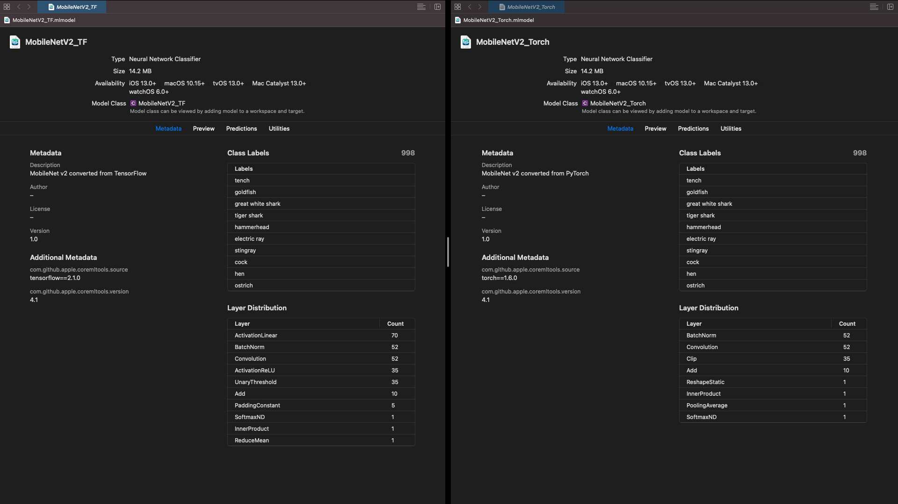
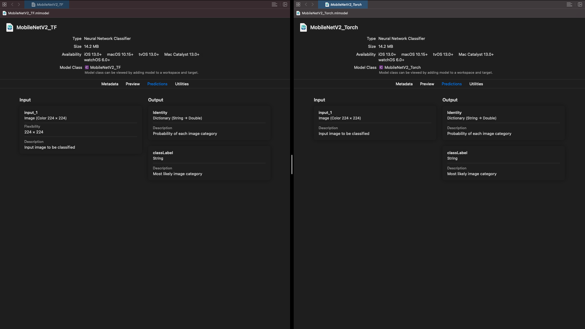

# Convert to Core ML Demo

This repository shows example code for the same Core ML model when converted from TensorFlow and when converted from PyTorch.

## Requirements
- `coremltools 4.1`
- `tensorflow 2.1`
- `torch 1.6`
- `torchvision 0.7`

See requirement.txt for all required packages

## Example of Unified Conversion API - MobileNet

Example of converting pre-trained MobileNet v2 from TensorFlow and PyTorch.

Code is [here](./UnifiedConversionAPI_MobileNet.ipynb).

